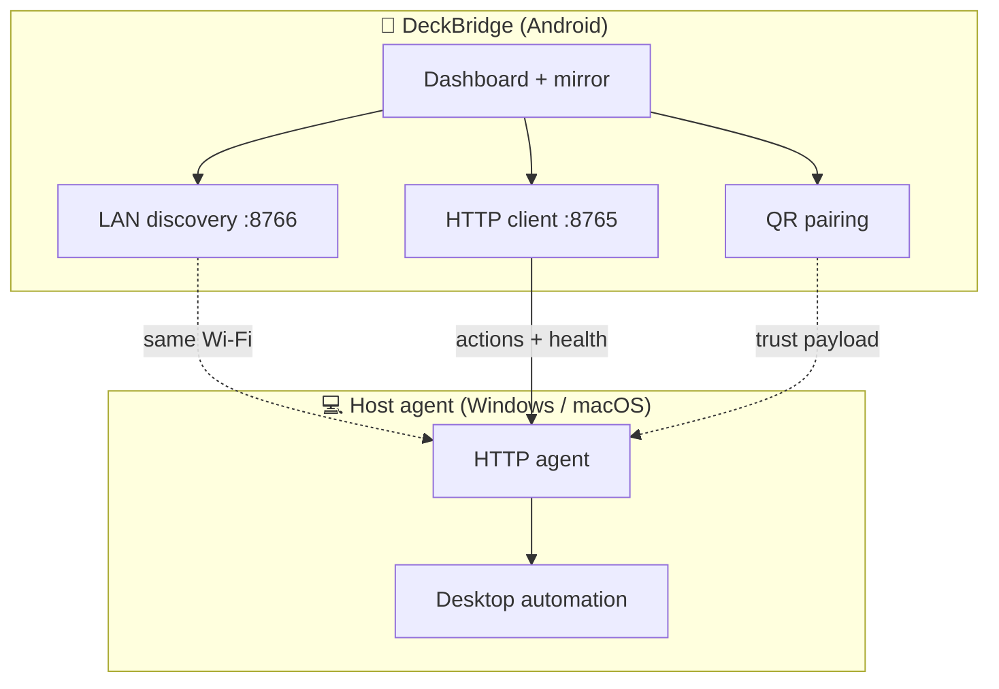
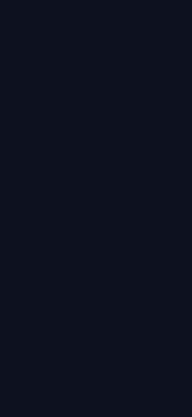
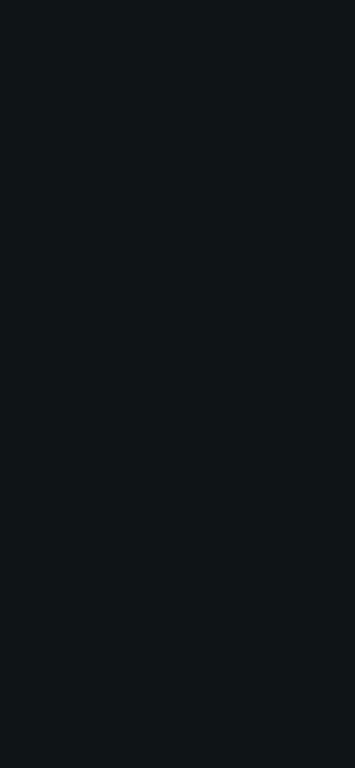
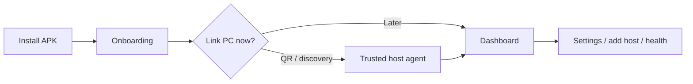

# DeckBridge

**DeckBridge** turns your Android phone into the control surface for a **hardware-style macro deck**—while **host agents** on your Windows or macOS machine receive actions over the **LAN** and drive the desktop for you.

Pair once with a short **onboarding** flow, link a computer via **QR / discovery**, and use the **live mirror** to see pad highlights, knobs, and host context at a glance. The app is built for a **two-device story**: phone as deck, PC or Mac as execution host.

<p align="center">
  <a href="https://github.com/JUANES545/DeckBridge/releases/latest">
    
  </a>
  &nbsp;
  <a href="https://github.com/JUANES545/DeckBridge/releases/latest">
    
  </a>
</p>

> **Stable build:** always grab the APK from **[Releases → Latest](https://github.com/JUANES545/DeckBridge/releases/latest)**. Version and release notes live next to the download.

---

## Host agents (ready flow)

DeckBridge is designed around **first-party host agents** on the same network:

| Capability | What you get |
|------------|----------------|
| **Discovery** | UDP broadcast on **8766** to find agents on Wi‑Fi |
| **Control plane** | HTTP to the agent (default **8765**) for health, pairing, and action delivery |
| **Pairing** | Guided **PC connection** flow with **QR** payload handoff so the phone trusts the right host |
| **Trust & recovery** | Settings let you refresh endpoints, re-run discovery, and open **“add another computer”** when you change machines |

Agents run **outside** this repository (Windows / macOS installers or binaries maintained separately). This repo ships **only the Android app** (`:app`).



---

## Experience walkthrough

Suggested reading order: **first run → home → settings**.  
*Figures below are **tone placeholders** (same aspect ratio as a phone). Replace with real device screenshots anytime: `bash scripts/capture-readme-screenshots.sh` (requires `adb` + a running emulator or USB device with the app installed).*

### 1 · Onboarding

Guided first run; **Skip** sits top-right if you already use DeckBridge on another install.

<p align="center"></p>

### 2 · After onboarding

Connection gate or hand-off before you land on the main deck—this is where **PC / agent pairing** starts when you choose it.

<p align="center"></p>

### 3 · Dashboard

**Hardware mirror**, deck grid, and host platform context—where you spend most of your time.

<p align="center"></p>

### 4 · Settings

**Agents & delivery**: discovery, LAN endpoint, health checks, **add another computer**, calibration entry, and advanced toggles.

<p align="center"></p>



---

## USB gadget HID (optional, advanced)

Some builds can probe **USB gadget HID** nodes (`hidg*`) for **direct keyboard injection** when the kernel exposes writable devices. That path is **fragile and device-specific**—it is aimed at **privileged / root-capable** setups and is **not** required for the normal **LAN agent** experience. Most users should rely on **Wi‑Fi + host agent** only.

---

## Build from source

```bash
./gradlew :app:assembleDebug
```

Release signing uses `keystore.properties` + `keystore/` (see `keystore.properties.example`); those files stay **out of git**.

```bash
./gradlew :app:assembleRelease
```

---

## Changelog & releases

Human-readable history: [`CHANGELOG.md`](CHANGELOG.md).  
GitHub Releases attach a **signed APK** for each stable tag (see **Download latest APK** above).
