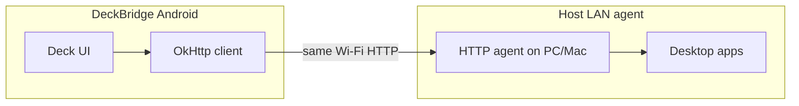

# DeckBridge

Android companion that mirrors a hardware macro deck and sends shortcuts to a host computer **over the LAN** (HTTP agent on the same Wi‑Fi) or **over USB gadget HID** (`/dev/hidg*`) when that path is available.

The LAN agent (Windows or macOS) is maintained **outside** this repository. This repo contains **only the Android application** (`:app`). The phone discovers agents over **UDP 8766** and talks HTTP (default **8765**); you can set host and port manually in Settings.

### Diagram



## Building the Android app

Open the project in Android Studio and run the `app` configuration, or use Gradle:

```bash
./gradlew :app:assembleDebug
```
